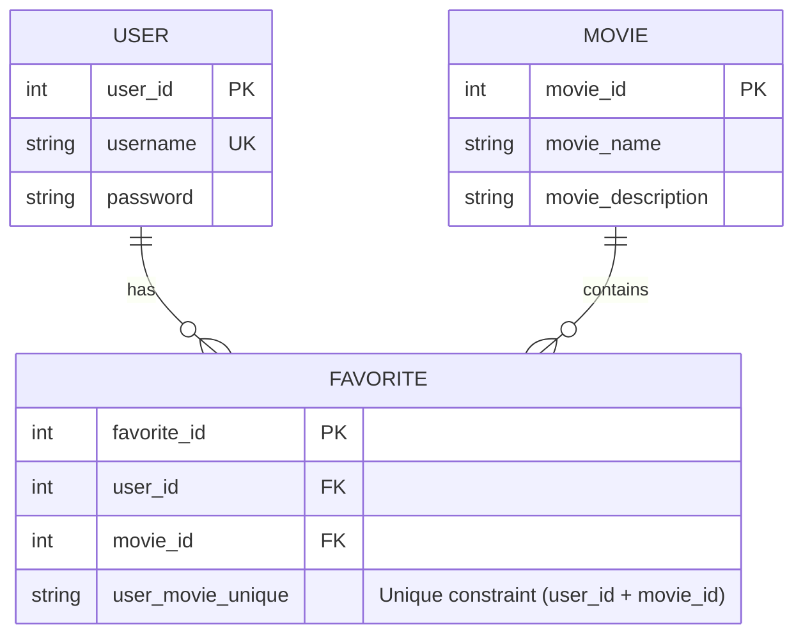

# 🎬 Backend: Simple Movie App (FastAPI)

This is the backend service for the **ReactJS Movie App**, built with **FastAPI**.  
It provides REST API endpoints for managing users and their favorite movies.

---

## 🚀 Setup

### 1. Create Virtual Environment

```bash
python -m venv venv
source venv/bin/activate   # Linux / macOS
venv\Scripts\activate      # Windows
```

### 2. Install Dependencies

```bash
pip install -r requirements.txt
```

### 3. Run Development Server

```bash
uvicorn main:app --reload
```

API Docs available at:

- Swagger UI → [http://127.0.0.1:8000/docs](http://127.0.0.1:8000/docs)

---

## 🌍 CORS Configuration

The backend allows frontend requests from:

- `http://localhost:3000` (local React app)
- `https://yourfrontend.com` (production app)

Allowed methods: `GET`, `POST`  
Allowed headers: `Content-Type`, `Authorization`

---

## 📌 API Endpoints

### Hello Endpoint

| Method | URL      | Description                  | Params | Request Body | Response                       |
| :----- | :------- | :--------------------------- | :----- | :----------- | :----------------------------- |
| GET    | `/hello` | Test route for server health | None   | None         | `{ "message": "Hello World" }` |

---

### 👤 User Endpoints

| Method | URL      | Description    | Params | Request Body                               | Response                         |
| :----- | :------- | :------------- | :----- | :----------------------------------------- | :------------------------------- |
| GET    | `/user/` | Get all users  | None   | None                                       | List of users with their details |
| POST   | `/user/` | Add a new user | None   | `{ "username": "str", "password": "str" }` | Created user object              |

---

### ⭐ Favorites Endpoints

| Method | URL                  | Description                    | Params                          | Request Body                                                                      | Response                                   |
| :----- | :------------------- | :----------------------------- | :------------------------------ | :-------------------------------------------------------------------------------- | :----------------------------------------- |
| GET    | `/favorites/`        | Get favorite movies for a user | `user_id: int` (query param)    | None                                                                              | List of favorite movies with movie details |
| POST   | `/favorites/`        | Add a new favorite movie       | `user_id: int` (query param)    | `{ "movie_id": int, "movie_name": "str", "movie_description": "str (optional)" }` | Created favorite entry                     |
| POST   | `/favorites/remove/` | Remove a favorite movie        | `user_id: int`, `movie_id: int` | None (params are passed in query)                                                 | `{ "status": "removed" }`                  |

---

## 🗂️ Data Models

### User

```json
{
  "user_id": 1,
  "username": "john",
  "password": "hashed",
  "favorites": []
}
```

### Favorite

```json
{
  "user_id": 1,
  "movie_id": 101,
  "movie_name": "Inception",
  "movie_description": "A mind-bending thriller"
}
```

## 📝Entity Relationship Diagram


